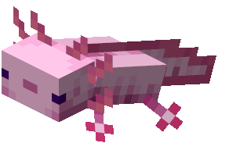

# Axolotl

## about the name
because it's cute, 
and MC 1.17 is the last version with world hight 256

## references
[GloomScript](https://github.com/Xie-Jason/GloomScript)
    梦开始的地方 
[compiler explorer](https://godbolt.org/)
    特别棒的工具, 参考了一些字节码的设计 
[in my collections](dongdigua.github.io/internet_collections)
    two tutorial, and my notes on tsoding's bm 
### serialization
[bincode](https://github.com/bincode-org/bincode) 
I don;t quite understand [on SO](https://stackoverflow.com/questions/25410028/how-to-read-a-struct-from-a-file-in-rust) 
YouTube: [c serialization](https://youtu.be/QrKpqdBiFRI) 

## TODO
- lambda/make function
- syscall? native function(like tsoding day 4)

